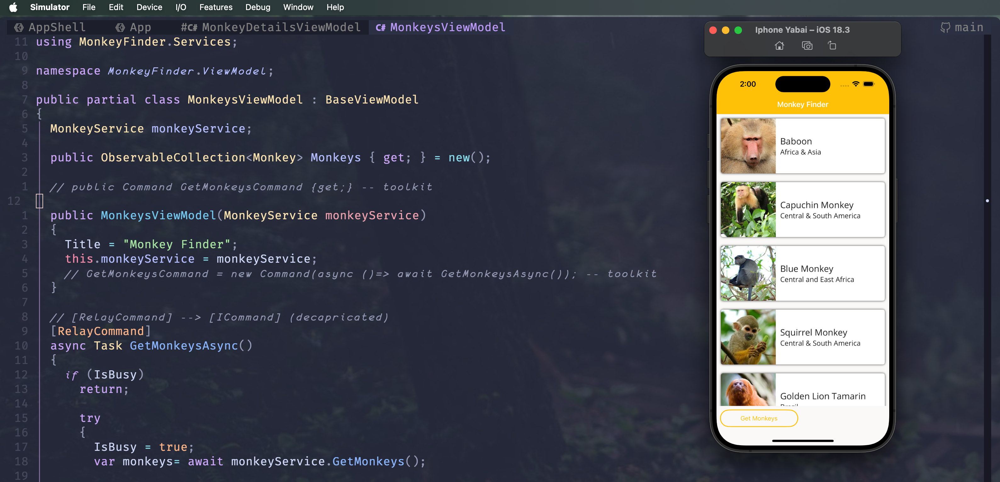

# .NET MAUI - Workshop

## Agenda
I have also put together an abstract of what you can expect for the day long workshop:

* [Part 0](Part%200%20-%20Overview/README.md) - 30 Min Session - Introduction to .NET MAUI Session & Setup Help ✅
* [Part 1](Part%201%20-%20Displaying%20Data/README.md) - Single Page List of Data ✅
* [Part 2](Part%202%20-%20MVVM/README.md) - MVVM & Data Binding ✅
* [Part 3](Part%203%20-%20Navigation/README.md) - Navigation (Currently)
* [Part 4](Part%204%20-%20Platform%20Features/README.md) - Implementing Platform Features
* [Part 5](Part%205%20-%20CollectionView/README.md) - CollectionView & Beyond
* [Part 6](Part%206%20-%20AppThemes/README.md) - Theming the app

